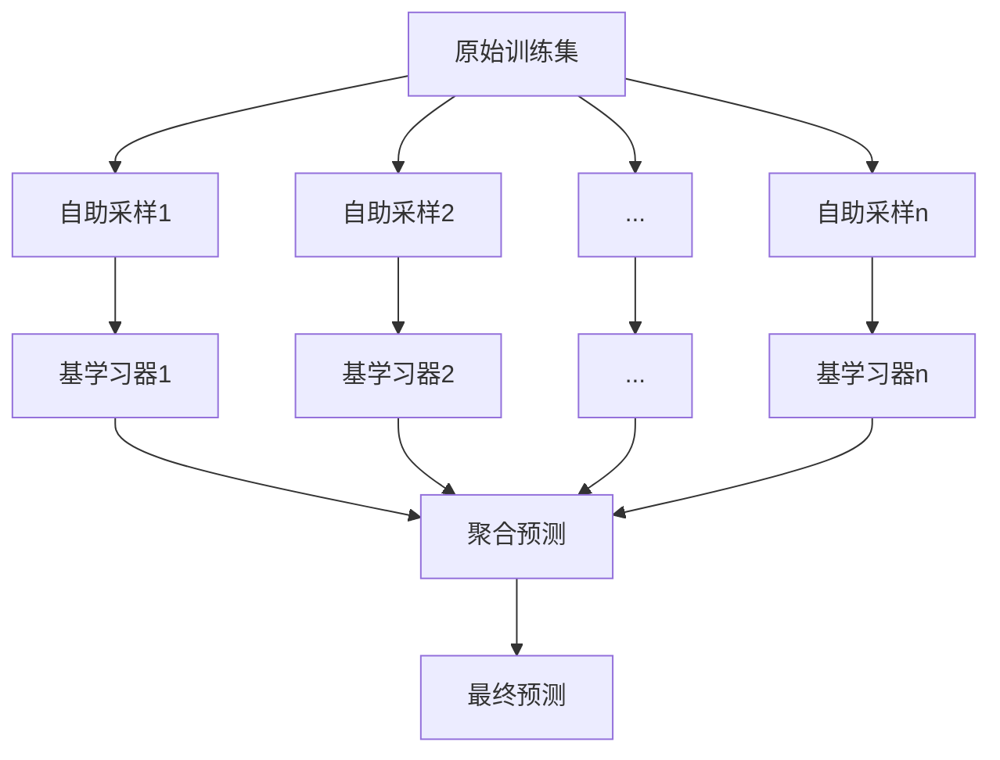

# Bagging算法详解：从原理到预测实现

## Bagging核心思想

Bagging（Bootstrap Aggregating）是一种集成学习方法，其核心思想是通过组合多个在不同数据子集上训练的模型来提升整体模型的稳定性和准确性。其过程可概括为：

- **并行训练**：通过自助采样（Bootstrap Sampling）创建多个不同的训练子集，然后在每个子集上独立、并行地训练一个基学习器。
- **结果聚合**：通过投票（分类任务）或平均（回归任务）的方式，将所有基学习器的预测结果组合起来，形成最终的预测。



## 关键步骤详解

### 1. 自助采样（Bootstrap Sampling）

- 从包含 N 个样本的原始训练集中，**有放回地随机抽取** N 次，形成一个大小为 N 的自助样本集。

- 由于是有放回抽样，原始训练集中的某些样本可能在自助样本集中出现多次，而另一些则可能一次也不出现。

- 可以证明，在 N 足够大的情况下，一个样本在 N 次抽样中一次都未被抽中的概率约为 36.8。计算方式如下：

  

  P(未被选中)=(1−N1)N≈e1≈0.368

- 这些从未被抽中的样本（约36.8%）组成了**袋外样本（Out-of-Bag, OOB）**，它们可以作为一个天然的验证集，用于评估模型性能而无需额外划分验证集。

### 2. 基学习器训练

- 在每一个自助样本集上，独立地训练一个**同质**的基学习器（例如，所有基学习器都是决策树）。
- 由于每个基学习器的训练数据不同，它们之间会存在差异性，这是Bagging能够成功降低方差的关键。
- 常用的基学习器包括决策树（这是随机森林的基础）、线性模型、神经网络等。

### 3. 预测结果聚合（以20个基学习器为例）

#### 分类任务 - 多数投票法 (Hard Voting)

```python
# 假设有20个基分类器对新样本x的预测结果
# predictions = [cls1.predict(x), cls2.predict(x), ..., cls20.predict(x)]
# 示例: predictions = ['A', 'B', 'A', 'A', 'C', ...]

# 统计每个类别的得票数
from collections import Counter
vote_counts = Counter(predictions)

# 选择得票最多的类别作为最终预测
# most_common(1) 返回一个列表，如 [('A', 15)]
final_prediction = vote_counts.most_common(1)[0][0]
```

#### 回归任务 - 平均法

```python
# 假设有20个基回归器对新样本x的预测结果
# predictions = [reg1.predict(x), reg2.predict(x), ..., reg20.predict(x)]
# 示例: predictions = [10.5, 11.2, 10.8, 9.9, ...]

# 计算所有预测值的平均值作为最终预测
final_prediction = sum(predictions) / len(predictions)
```

## 为什么Bagging有效？

### 1. 方差减少效应

- Bagging的核心优势在于能够显著降低模型的**方差**。
- 对于不稳定的模型（如未剪枝的决策树），其预测结果在训练数据发生微小变化时会产生较大波动（即高方差）。
- 通过对多个独立训练的模型的预测结果进行平均，可以有效平滑掉这些波动。直观上，如果每个模型的误差是随机的，那么平均之后这些误差会相互抵消。
- 对于Bagging，虽然各基学习器不完全独立（因为训练数据都来自同一个原始集），但自助采样也保证了它们之间的差异性。聚合之后，模型的方差会降低。更精确的数学描述见文末“数学原理补充”部分。

### 2. 误差分解

- 模型的泛化误差可以分解为三个部分：

  总误差 = [偏差]^2 + 方差 + 噪声

- **偏差（Bias）**：模型预测的期望值与真实值之间的差距。高偏差意味着模型欠拟合。

- **方差（Variance）**：模型在不同训练集上的预测结果的变化程度。高方差意味着模型过拟合。

- Bagging主要通过降低**方差**来减少总误差，而对偏差的影响不大。因此，它对高方差、低偏差的模型（如深度决策树）效果尤为显著。

## 随机森林：Bagging的经典实现

随机森林（Random Forest）是Bagging的一个成功扩展，它在Bagging的基础上引入了**特征随机化**，进一步增强了基学习器之间的差异性。


### Python实现示例

```python
from sklearn.ensemble import RandomForestClassifier
from sklearn.datasets import make_classification
from sklearn.model_selection import train_test_split
import numpy as np
from scipy.stats import mode

# 生成模拟数据
X, y = make_classification(n_samples=1000, n_features=20, n_informative=10, n_redundant=5, random_state=42)
X_train, X_test, y_train, y_test = train_test_split(X, y, test_size=0.2, random_state=42)

# 创建包含20棵树的随机森林
# n_estimators: 森林中树的数量
# max_samples: 每棵树训练时使用的样本比例（自助采样）
# max_features: 每棵树在分裂节点时考虑的特征比例
# oob_score: 是否使用袋外样本来评估泛化能力
rf = RandomForestClassifier(n_estimators=20,
                            max_samples=0.8,
                            max_features=0.7,
                            oob_score=True,
                            random_state=42)

# 训练模型
rf.fit(X_train, y_train)

# 使用模型进行预测
y_pred = rf.predict(X_test)
print(f"模型在测试集上的准确率: {rf.score(X_test, y_test):.4f}")
print(f"模型的OOB分数: {rf.oob_score_:.4f}")

# 查看每棵树的预测（基学习器输出）
tree_predictions = [tree.predict(X_test) for tree in rf.estimators_]

# 手动实现投票
# np.array(tree_predictions) 的形状为 (n_estimators, n_samples_test)
all_preds = np.array(tree_predictions)
# 沿 axis=0 (树的维度) 取众数
final_preds_manual, _ = mode(all_preds, axis=0, keepdims=False)

# 验证手动投票结果与rf.predict()是否一致
print(f"手动投票与模型预测结果是否一致: {np.all(final_preds_manual == y_pred)}")
```

## Bagging vs. Boosting

| **特性**         | **Bagging**                          | **Boosting**                                |
| ---------------- | ------------------------------------ | ------------------------------------------- |
| **基学习器关系** | 独立并行训练，无依赖关系             | 顺序依赖训练，后一个模型修正前一个的错误    |
| **样本权重**     | 所有样本权重相等（通过随机抽样体现） | 错误分类的样本权重在后续迭代中增加          |
| **主要目标**     | **减少方差 (Variance)**              | **减少偏差 (Bias)**                         |
| **过拟合倾向**   | 不易过拟合，模型更稳定               | 可能会过拟合，需要仔细调参                  |
| **典型算法**     | 随机森林 (Random Forest)             | AdaBoost, Gradient Boosting (GBDT), XGBoost |
| **数据使用**     | 自助采样，每个模型只用一部分数据     | 通常使用全量数据集进行训练                  |

## 数学原理补充

### 偏差-方差分解

对于回归问题，一个模型的期望泛化误差（Expected Mean Squared Error）可以分解为：


E[(y−f^(x))2]=[Bias(f^(x))]2+Var(f^(x))+σ2


其中：

- y 是真实值。
- hatf(x) 是模型对样本 x 的预测。
- [textBias(hatf(x))]2 是偏差的平方，代表模型预测的平均值与真实值之间的差异。
- textVar(hatf(x)) 是方差，代表模型在不同训练集上预测结果的波动性。
- sigma2 是不可约减的误差（噪声），由数据本身决定。

### Bagging如何降低方差

Bagging通过平均多个基学习器的输出来降低方差。对于一个由 B 个基学习器 hatf∗b 组成的Bagging集成模型 hatf∗textbag，其方差为：


Var(f^bag)=Var(B1b=1∑Bf^b(x))=B21i=1∑Bj=1∑BCov(f^i(x),f^j(x))


假设每个基学习器的方差都为 sigma2，且任意两个基学习器之间的相关系数都为 rho，则上式可以简化为：


Var(f^bag)=ρσ2+B1−ρσ2


从这个公式可以看出：

- 当 Btoinfty 时，右边第二项趋近于0，整个集成的方差趋近于 rhosigma2。
- 这意味着，只要基学习器之间不是完全相关的（即 rho\<1），Bagging总能降低方差（因为 frac1−rhoBsigma20 且 rhosigma2 小于单个模型的方差 sigma2）。
- Bagging通过**自助采样**来减小基学习器之间的相关性 rho，从而达到更好的降方差效果。随机森林更进一步，通过**特征随机化**来进一步降低 rho。

## 实际应用建议

1. **基学习器选择**：优先使用高方差、低偏差的模型，如未剪枝或轻度剪枝的决策树。
2. **增强多样性**：除了样本采样，可以引入特征采样（如随机森林）来进一步降低基学习器间的相关性。
3. **并行化**：Bagging的基学习器训练过程是完全独立的，非常适合利用多核CPU进行并行计算，从而大大缩短训练时间。
4. **OOB验证**：充分利用OOB数据进行模型评估和参数选择，可以省去交叉验证的计算开销。
5. **超参数调优**：重点关注：
   - `n_estimators`（基学习器数量）：通常越多越好，直到性能稳定。
   - `max_samples`（采样比例）：控制每个基学习器训练数据的差异性。
   - `max_features`（特征采样比例，随机森林特有）：控制决策树分裂时的随机性，是降低相关性的关键。

通过Bagging，我们能够将多个不稳定的弱学习器组合成一个强大的强学习器，显著提升模型的稳定性和泛化能力，尤其在复杂数据集上表现出色。